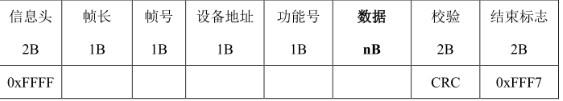
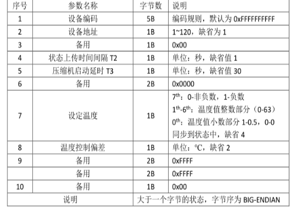
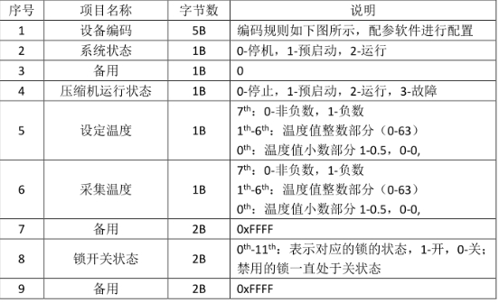
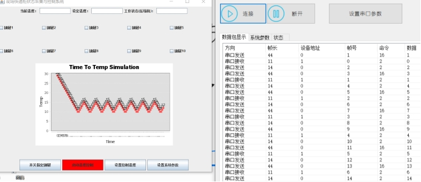
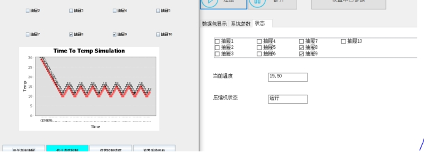
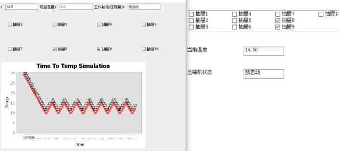
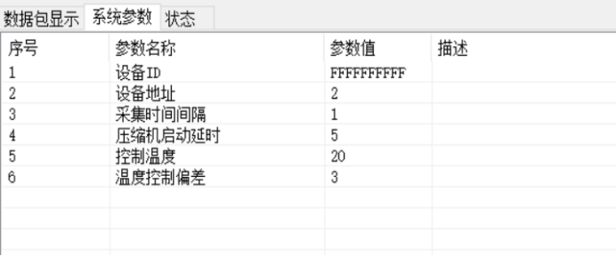
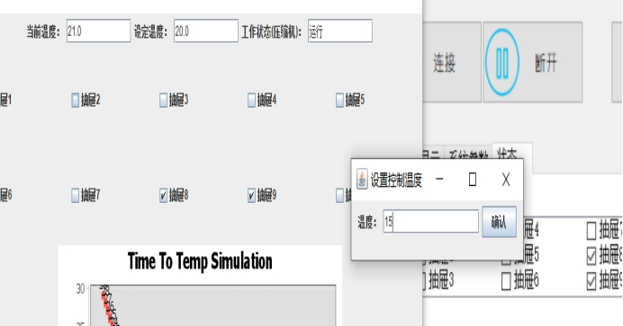
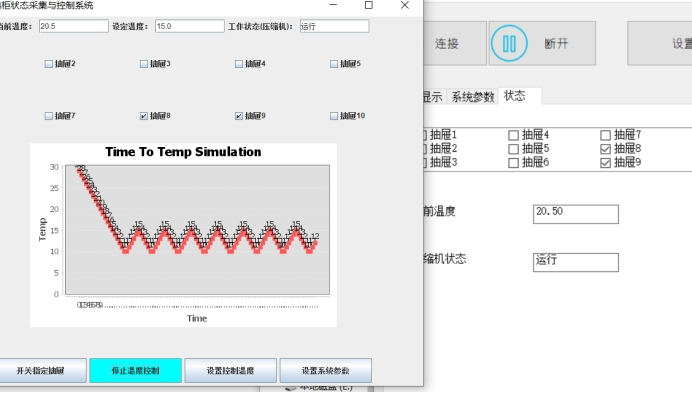

### 一、课程设计名称 ：感知与控制课程设计

### 二、课程设计目的与要求

#### 2.1课程设计目的

（1）了解现场网感知与控制的基本方法。

（2）掌握基于RS232的协议设计与通信方法，在此基础上实现对现场设备状态数据的采集、对设备的控制。

（3）针对快递柜系统设计实现一个对现场快递柜状态数据采集、显示、参数设置、抽屉打开、保鲜控制等功能软件系统。

#### 2.2课程设计要求

2人一组独立完成实验，分工明确，实现平台与编程语言(工具)不限，并在此基础上按附件格式要求完成课程设计实验报告。

### 三、课程设计原理与方案

#### 3.1课程设计内容

(1)理解快递柜控制板仿真软件的通信协议(见附件)，并设计实现，进而实现与快递柜控制板仿真软件(见附件)的通信(对于控制命令要考虑可靠传输)。

(2)实现对快递柜控制板状态数据的采集与显示，包括当前温度、控制温度、控制状态、10个抽屉的开关状态。

(3)实现对开关指定抽屉、启停温度控制(压缩机制冷控制)、设置控制温度、以及设置系统参数等设置操作。

(4)依据控制温度和压缩机的启停控制，实现对快递柜控制板温度的控制，控制精度为1度。

(5)以曲线方式显示1小时内的当前温度和设定温度的变化趋势。

#### 3.2课程设计方案

##### 3.2.1课程设计原理

###### 3.2.1.1编程语言与平台

语言: Java语言，java是一 种面向对象的高级语言，自问世以来，因其简单性、

面向对象、分布式、健壮性、安全性、平台独立与可移植性、多线程、动态性

等特点广受编程人员喜爱，eclipse则是一款官方推出的IDE。因为java的简单性和丰富的类库，所以选择java作为编程语言。通过导入RXTEcomm.jar类库来重写串口，设置相关功能函数。使用Bottom、JTextField 、Jlabel等组件来构建界面。

###### 3.2.1.2设计原理

（1）技术: RS232通信协议。RS-232是串行数据接口标准之一, 数据帧结构包括:信息头、帧长、帧号、设备地址、功能号、数据、校验、结束标志。具备传输距离短、速度较慢的特点，适合小型单片机开发，适合本项目使用。

波特率:这是一个衡量通信速度的参数，它表示每秒钟传送的bit的个数。本项目采用的波特率为38400。数据位:这是衡量通信中实际数据位的参数。本项目的数据位为8位。停止位:用于表示单个包的最后一位。本项目的停止位为1。奇偶校验位:在串口通信中一种简单的检错方式。有四种检错方式:偶、奇、高和低。本项目采用无校验。

（2）实现原理

采用RS232协议来进行串口通信，将快递柜和控制板的相关参数设置(串口号、波特率、数据位、校验位)好，建立快递柜和控制板的通信连接。将相关指令封装，把16进制的指令进行封装，避免输入过长的16进制指令，精简使用流程。采用图形界面进行操作，构建便捷的界面，将封装好的指令与按钮相关联，通过按钮发送相关指令。实现对快递柜的控制。

将整个项目划分为3个部分:由图像界面组成的操作界面，通信部分来实现具体通信功能。通信部分又分为数据接受和数据发送，串口之间进行通信时，将数据存储在一一个缓存区域内，若是发送指令，则将指令编码写入缓存区域，将缓存区域的数据通过串口发送给快递柜。从快递柜收到的消息也存储在缓存区域，然后将数据解析，从中找到需要的字段，再进行转换，输出到界面，实现实时显示快递柜信息的功能。

###### 3.2.1.3可靠传输

如果接收端，收到一帧数据，经过CRC校验，数据正确，这时得传一帧简易的应答帧，以告诉主机，这个帧接收成功。如果接收端，收到一帧数据，经过CRC校验，发现数据有错，这时得传一帧简易的重传帧，以请求重传。

##### 3.2.2数据帧分析

###### 3.2.2.1数据帧格式

 

帧号：取值范围1-255。

帧长：为每个物理帧的实际长度，取值为10-256。

设备地址：1字节，控制板地址为1-120。

###### 3.2.2.2数据帧定义

（1）查询帧

查询帧帧长10字节，帧号n，设备地址是控制板的地址1-120，功能号01，数据0B为NULL，每间隔5秒定期对每块控制板发送一次查询帧。

（2）启停压缩机控制帧

启停压缩机控制帧对压缩机进行启停控制，帧长11字节，帧号为n，功能号02，设备地址1-120，数据部分01代表压缩机启动，00代表压缩机停止。

（3）开锁帧

开锁帧负责对快递柜指定抽屉的开关控制，帧长12字节，帧号n，设备地址是1-120，功能号为03，数据部分为2字节，其中0th-11th,表示对应的锁的状态，1代表开，0代表关。首先，我们将某- -所需数据转换成2进制， 利用字符串的加操作完成对每一位的判断，之后会获得两个字符串， 对它们进行进制转换，将其转换成两位16进制数，我们就可以通过指定格式完成帧的组成。

（4）设置温度帧

设置温度帧对温度进行设置，帧长11字节，帧号n，设备地址是1-120，功能号为04，数据部分为设定的温度值，7th:0代表非负数，1代表负数，1th-6th表示温度整数部分0-63，0th表示温度小数部分，存在0.5，0，1代表0.5，0代表0。在文本框中输入设定温度后，获得一字符串，依次检测其符号和字符串长度，注意最后剩余整数部分要通过十进制转2进制完成并在前位补0凑齐六位，加之首尾各-位完成8位2进制， 通过进制转换得到16进制数。

（5）设置参数帧

参数帧负责控制板参数，帧长28字节，帧号n，设备地址是OX75，功能号为05，参数部分18字节，参数具体见下图。

 

（6）设置温度控制偏差帧

设置温度温度偏差帧帧长11字节，帧号n，设备地址是1-120，功能号为06，数据部分1字节，设定温度控制偏差，数据按终端控制板参数表中的格式定义参数。

（7）设置设备地址帧

设置设备地址帧帧长16字节，帧号n，设备地址是OX7F，功能号为09，数据部分6字节，5字节设备编码和1字节新地址。

（8）上传状态帧

上传状态帧帧长16字节，帧号n，设备地址是OX7F，功能号为10，数据部分6字节，数据部分34字节，参数是终端控制板的当前参数，18字节参数和16字节状态，控制板参数见图，控制板状态参数具体见下图。

 

（9）ACK帧

ACK帧帧长14字节，帧号n，设备地址是0，功能号应答的功能号，数据部分6字节，数据部分4字节，1字节设备地址，1字节命令帧号，2字节数据，数据用于执行开锁命令后表示相应锁是否打开，对应位1表示打开，否则打开失败。可靠传输采用重传机制，若在一定时间段内收不到相应功能号的ACK，则重新传送。

##### 3.2.3功能设计

###### 3.2.3.1信息采集

```java
public double getTemperature_gather() {/*采集温度*/
    	
       String str=FormatConverter.byteToHexStr(temperature_gather);
       int i1= Integer.parseInt(String.valueOf(str.charAt(0)),16);
       int i2=Integer.parseInt(String.valueOf(str.charAt(1)),16);
       int ii1[];
        ii1=new int [8];
       for(int n=0;n<4;n++)
       {
    	   ii1[n]=i1%2;
           i1=i1/2;
       }
       for(int n=4;n<8;n++)
       {
    	   ii1[n]=i2%2;
           i2=i2/2;
       }
       double x=ii1[5]*1+ii1[6]*2+ii1[7]*4+ii1[0]*8+ii1[1]*16+ii1[2]*32;
       if(ii1[4]==1)
    	   x=x+0.5;
    	 
         if(ii1[3]==1)
        	x=x*(-1);
       
    	return x;
    }   
    public int getMachine_state() {/*机器状态*/
    	String str=FormatConverter.byteToHexStr(machine_state);
    	 int i=Integer.parseInt(str,16);
    	return i;
    }

 
```

###### 3.2.3.2抽屉的控制

设置10个按钮分别控制10个抽屉，点击按钮改变对应的开关位，抽屉控制将需要控制的抽屉编号加入列表，传参到对应函数。函数经过提取，将列表中出现的抽屉对应位置1.以此类推转化为对应的二进制数字，再转化为十六进制，加入到对应命令帧的数据位，CRC填充完发送。

```java
button.setPreferredSize(new Dimension(150, 40));
            add(button);
            setVisible(true);
            button.addActionListener(new ActionListener() {
                @Override
                public void actionPerformed(ActionEvent e) {
                	command="";
                    for(int i=0;i<10;i++) {
                        if(checkBox[i].isSelected()) {
                        	checkBox1[i].setSelected(true);
                            command+=checkBox[i].getText();
                        }
                    }
                    String regEx="[^0-9]";
                    Pattern p = Pattern.compile(regEx);
                    Matcher m = p.matcher(command);
                    command=m.replaceAll("").trim();
                    System.out.println(command);
                    long sum=0;
                    for(int i=0;i<command.length();i++)
                    {
                        char s=command.charAt(i);
                        System.out.println(s);
                        switch(s)
                        {
                           
                            case '1':  if((command.length()==1)||command.charAt(i+1)!='0')sum+=256;else sum+=2;break;
                            case '2':sum+=512;break;
                            case '3':sum+=1024;break;
                            case '4':sum+=2048;break;
                            case '5':sum+=4096;break;
                            case '6':sum+=8192;break;
                            case '7':sum+=16384;break;
                            case '8':sum+=32768;break;
                            case '9':sum+=1;break;
                            default:break;
                        }
                    }
```

###### 3.2.3.3启停温度控制

启停压缩机根据之前的数据分析结果，利用数据位的00和01进行压缩机的控制。启动压缩机需要考虑和温度偏差范围的配合。高于则停止，低于则运行。只有启动了温度控制，才会对接收到的实时温度进行判断是否达标(设置温度+-偏差值)，进而发送控制帧控制压缩机的停止启动。

```java
if(button2.getText().equals("启动温度控制"))	{
                        button2.setBackground(Color.CYAN);
                        button2.setText("停止温度控制");
                        command="01";
                        createFrame(2);
                    }
                    else {
                        button2.setBackground(Color.RED);
                        button2.setText("启动温度控制");
                        command="00";
                        createFrame(2);/*启停压缩机指令*/}}
```

###### 3.2.3.4设置控制温度

在Textbox组件输入温度，点击按钮，设定中当温度控制系统处于开启状态，若检测到温度低于设定，则停止压缩机，若检测到温度高于设定，则打开压缩机，但此时压缩机会有预启动状态，所以在其预启动与启动状态不发送打开压缩机命令。

```java
public void actionPerformed(ActionEvent e) {
                	String Tem=textField.getText();
                    dispose();
                    float tem=Float.parseFloat(Tem);
                    int t=(int)tem;
                    String s = Integer.toString(t);
                    textField2.setText(s);
                    boolean flag=false;
                    t=t*2;
                       if(tem<0)
                    {
                    	t=t*(-1);
                    	 t=t+128;
                     //   t=t+1;
                    }
                    
                    if((tem%1)==0.5)
                    {
                        
                        t=t+1;
                        flag=true;
                        
                    }                       
                    if(t<15) {
                        command="0"+Integer.toHexString((int)t);
                    } else {
                        command=Integer.toHexString((int)t);
                    }
                    command=command.toUpperCase();
                    System.out.println(tem);
                    System.out.println("设置温度command= "+command); 
                    downQueue.add(new SetTemperatureFrame(sequence++,deviceAddress,FormatConverter.hexStringToBytes(command)[0]));/*设置温度*/
```

​        

###### 3.2.3.5设置系统参数

参数控制包括温度，温度偏差，设备地址，压缩机预启动时间等处理方法类似。将输入的十进制数字转化为十六进制，加入到对应命令帧的数据位，CRC填充完发送。点击按钮弹出参数设置窗口， 允许不做任何输入或只设置部分参数，

不输入会默认发送上次设置的参数，如果是第一次则发送缺省值。对于组帧，要先得到文本框内字符串、先转2进制，再转16进制，组成相应帧即可。系统参数帧会有缺省情况，因此在文本框输入字符串中若为空，则使用相应缺省数据填充该位。

```java
enter.addActionListener(new ActionListener() {
                @Override
                public void actionPerformed(ActionEvent e) {
                	String[] str=new String[6];
                	command="";
                	for(int i=0;i<6;i++) {
                		
                		if(i==0)//设备编码
                			{
                				for(int j=textField[i].getText().length();j<10;j++)

                					command+="F";
                				command+=textField[i].getText();
                			}	
                    
                    	if(i==1)//设备地址
                    		command+=textField[i].getText();
                    	if(i==2)//上传间隔
                    	{
                    		command+="00";//备用空白帧
                    		command+=textField[i].getText();
                    		}
                    	if(i==3)//启动时延
                		{
                    	String tem=textField[i].getText();
                    	int mn=Integer.parseInt(tem);
                    	String hexs=new String();
                    	if(mn>15)
                    	hexs =FormatConverter.intToHex(mn);
                    	else
                    		 hexs="0"+FormatConverter.intToHex(mn);
                    	
                		command+=hexs;
                		command+="0000";//备用
                		}
                    	if(i==4)//设定温度
                		{
                    	
                    		String Tem=textField[i].getText();
                            dispose();
                            String s=new String();
                            float tem=Float.parseFloat(Tem);
                            int t=(int)tem;
                            boolean flag=false;
                            t=t*2;
                               if(tem<0)
                            {
                            	t=t*(-1);
                            	 t=t+128;
                             //   t=t+1;
                            }
                            
                            if((tem%1)==0.5)
                            {
                                
                                t=t+1;
                                flag=true;
                                
                            }
                                              
                        
                            if(t<15) {
                                s="0"+Integer.toHexString((int)t);
                            } else {
                                s=Integer.toHexString((int)t);
                            }
                           s=s.toUpperCase();
                    		
                		command+=s;
                		
                		}
                    	if(i==5)//温度控制偏差
                		{
                		command+=textField[i].getText();
                		command+="FFFFFFFF00";
                		}        
                    	
                		
                		//command+=textField[i].getText();
                    }
                    System.out.println("设置参数command= "+command);   
                 dispose();
                 downQueue.add(new SetParameterFrame(sequence++,deviceAddress,FormatConverter.hexStringToBytes(command)));/*设置参数*/
                   //  	createFrame(5);
```

###### 3.2.3.6折线图的绘制

创建CategoryDataset对象（准备数据）。

根据Dataset 生成JFreeChart对象，以及做相应的设置。

根据CategoryDataset创建JFreeChart对象。

将仿真软件发送的数据放入内存，实现一个循环数组接受数据。

```java
if (values.size() > MAX_COUNT_OF_VALUES) {
	values.remove(0);
	 }
for (int i = 0; i < length - 1; ++i) {
	g2d.drawLine(xDelta * (MAX_COUNT_OF_VALUES - length + i), normalizeValueForYAxis(values.get(i), h),
	xDelta * (MAX_COUNT_OF_VALUES - length + i + 1), normalizeValueForYAxis(values.get(i + 1), h));
	 }
```

##### 3.2.4界面设计

###### 3.2.4.1界面布局

1)、流布局：

　　FlowLayout 从左到右，自上而下方式在容器中排列，控件的大小不会随容器大小变化.

  容器.setLayout(new FlowLayout(FlowLayout.LEFT));

2)、网格布局：

　　GridLayout 按照指定行数与列数，将容器分成大小相等的单元格每个单元格放置一个控件. 不能将控件放在指定单元格

  容器.setLayout(new GridLayout(3,4,10,15));

3)、边界布局:

　　BorderLayout 将容器分成东、西、南、北、中五个部分

  容器.setLayout(new BorderLayout());

　　窗口的内容面板默认布局就是边界布局。

容器.add(控件,BorderLayout.NORTH);

###### 3.2.4.2界面组件

文本框：使用JComponent的子类JTextField创建文本框。文本框的允许用户输入单行文本。

文本区：使用JComponent的子类JButton类创建按钮，允许用户单击按钮。

标签：使用JComponent的子类JLabel类创建标签，标签为用户提供信息提示。

选择框：使用JComponent的子类JCheckBox类来创建选择框，为用户提供多项悬着。选择框提供两种状态，选中和未选中，用户通过单击该组件切换状态。

单选按钮:使用JComponent的子类的JRadioButton类创建单项选择框，为用户提供单项选择。

下拉列表:使用JComponent的子类的JComboBox类来创建下拉列表，为用户提供下拉列表。

###### 3.2.4.3部分代码

```java
import org.jfree.chart.ChartFactory; 
import org.jfree.chart.ChartUtilities; 
import org.jfree.chart.JFreeChart; 
import org.jfree.chart.labels.StandardCategoryItemLabelGenerator; 
import org.jfree.chart.plot.CategoryPlot; 
import org.jfree.chart.plot.PlotOrientation; 
import org.jfree.chart.renderer.category.LineAndShapeRenderer; 
import org.jfree.data.category.CategoryDataset; 
import org.jfree.data.general.DatasetUtilities; 
public class Win extends JFrame {}建立窗体类。
private JLabel[] label;声明标签组
public JCheckBox[] checkBox1;
//建立三个 JTextField类型变量，textField1文本框显示当前温度，textField2文本框显示设置温度，textField3文本框显示压缩机状态。
Piblic Win{}//来设置布局和边界布局new BorderLayout()，设置窗口的长宽高setBounds(100,50,800, 650)， 设置标题setTitle("现场快递柜状态采集与控制系统");
private class Top extends JPanel{}//来设置顶部布局，建立三个标签，分别表示当前温度，设定温度，工作状态，再进行设置边界。
 public class center extends JPanel {}//来设置界面中的抽屉组，建立十个抽屉。规定他们的位置。
private class Bottom extends JPanel{}//来设置界面底部的四个按钮以及功能的实现，就是课设要实现的四个功能，开关指定抽屉，启动温度控制，设置控制温度，设置系统参数。
  button.addActionListener（new ActionListener()）//来进行事件的监听，实现根据用户的操作来执行相应功能。
JFreeChart jfreechart = ChartFactory.createLineChart()//来进行折线图标题，x轴，Y轴标签的显示。
//使用CategoryPlot设置各种参数。CategoryPlot plot = (CategoryPlot)jfreechart.getPlot();
renderer.setBaseShapesVisible(true); // series 点（即数据点）可见  
renderer.setBaseLinesVisible(true); // series 点（即数据点）间有连线可见  
renderer.setUseSeriesOffset(true); // 设置偏移量  
public void paintComponent(Graphics g) {}折线图的绘制。
```


### 四、课程设计结果

首先启动程序，可以看到虚拟串口软件中的com2已连接上，然后开启快递柜仿真程序，可以在虚拟串口软件中看到com1和com2都已连接，在eclipse控制台中也可以看到串口启动成功，接着在快递柜仿真软件数据包显示区和eclipse控制台也可以看到不断接受和发送数据帧，说明两者成功连接，可以通信，接着检验是否能正确通信和功能是否完全实现。




首先测试打开关闭抽屉功能，在采集与控制程序中打开7号和8号抽屉，可以在快递柜程序中看见两个抽屉正确打开，再实验其他抽屉，所有抽屉都能准确打开和关闭，快递柜抽屉开关功能完全实现。



 

信息采集与显示功能也正确实现，可以看到快递柜的当前温度和压缩机状态抽屉开关状态在采集与控制系统中都进行了正确显示，两者同步。



接着来测试参数控制功能，我们可以观察到，启动程序后快递柜仿真程序系统参数部分已经显示了数据，这是在采集与控制系统中默认的数据，接下来我们进行修改，观察能否正确传给快递柜仿真程序，先在采集与控制系统中点击系统参数设置按钮，在弹出来的框中输入参数数据，包括设备ID，设备地址，采集时间间隔，压缩机启动延时，控制温度等，上传参数后可以观察到快递柜仿真软件参数部分发生了改变，与我们上传的参数相同，所以参数控制功能也正确实现。



 

然后进行温度控制功能测试，首先我们在采集与控制系统中设置控制温度为15度，然后上传，可以看到信息进行更新，控制温度由原先默认的20度变为了15度，然后可以观察到快递柜仿真软件当前温度为20.5度，压缩机进行启动，温度在下降，因为参数中温度偏差设置为3度，所以在温度下降到12度时，压缩机停止工作，温度上升，上升到18度时，压缩机开始工作，可以看到温度在控制温度周围上下拨动，温度控制功能实现。



 




五、课程设计总结

本次课程设计主题是感知与控制，要求掌握基于RS232的协议设计与通信方法，在此基础上实现对现场设备状态数据的采集、对设备的控制。老师给出的题目是针对快递柜系统设计实现一个对现场快递柜状态数据采集、显示、参数设置、抽屉打开、保鲜控制等功能软件系统。

我们小组有三位成员，首先对题目进行了讨论，制定了初步课设计划，对每个人的任务进行大致分工，主要是通信实现，界面设计，数据帧分析，可靠传输的保证，ppt答辩等方面。我们共同完成了数据帧分析，然后各自负责实现某些功能，例如抽屉开关、温度控制、参数控制等，最后由组长进行整合，完成整个代码的实现。我们小组使用的语言是Java语言，可以调用类库来进行编程，减少了我们的工作量，利用的平台是eclipse，我们基本实现了通过控制面板对快递柜操作的控制，将指令封装后，通过点击按钮实现指令的发送，包括了相应的抽屉的开关、温度控制、温度设置等功能。但是还有许多不足之处，由于时间紧任务重，我们小组成员的编程能力和学习能力有限，界面有待优化，在温度曲线的输出功能方面没有完全实现，在实时上传数据并绘制成图没有成功，只做出了一个模拟图来进行输出，程序还有待完善，在课设结束后，我们还会继续讨论学习，争取实现其功能，还存在一些小细节问题有待处理，存在一些bug，例如有时候数据帧丢失，无法发送成功，还需要进一步去改进程序。

  从本次课程设计中，我们小组学习了基于RS232的协议设计与通信方法，了解了现场网感知与控制的基本方法，锻炼了自己的思考能力和编程能力，之前也没接触过这些知识，我们都很陌生，在十天的学习里，我们一边百度自学以及向老师同学请教，一边积极讨论，各抒己见，很大方面提高了自己的学习能力和团队协助能力，为日后学习和工作积累了项目经验。从本次课设中，我们也深刻体会到了自己编程能力还是很弱，刚开始一头雾水，先采用c++来写程序，但是遇到了很多问题，首先就是我们没用过MFC，在学习过程中也感觉很难，甚至通信有的时候都不能成功，压力很大。经过我们后来的讨论研究后组长决定使用Java语言，因为他比较擅长Java，而且在大二学年我们刚学Java，并且使用Java语言做过项目，对Java界面设计，类库调用还是比较熟悉，确定方向后我们开始奋力苦干，小组成员每天汇报进程，以及讨论所遇到的问题，积极想办法去解决，功夫不负有心人，我们最后程序大致完成了，虽然还有很多改善的地方，但是还是做出了一个成果。经过这次课设，我们感受到了编程的有趣，利用所学的知识进行编程去实际解决问题，感觉很美妙，很快乐。

 虽然课程设计结束了，但是学习不能结束，我们从本次课设中学习到了很多，这次课设也给了我们三个人一个警醒，让我们清醒了一下，明白了自己的水平在哪里，知道了自己和专业佼佼者的差距，在观看答辩过程中也见到了很多大佬的程序，五花八门，大开眼界，别人不仅完成课设还进行创新实践，成果非常棒，对比之下，我们感到很大压力，毕竟我们已经大二结束了，不考研的话，马上要找工作实习了，编程能力还急需提高，课设结束后就是暑假，经过这次对我们来说磕磕绊绊困难重重的课设，相信我们在暑假里也不敢放纵自我，每天沉浸于王者峡谷，在之后的日子里我们定当沉下心来，踏踏实实学习，多思考，多研究，提升自己的水平，不浪费自己的宝贵时间，成为一个优秀的大学生。